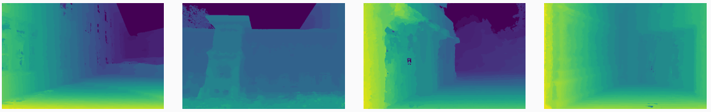
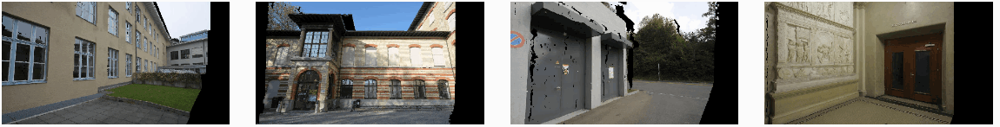

# DeepMVS: Learning Multi-View Stereopsis

[](https://opensource.org/licenses/BSD-2-Clause)

**DeepMVS** is a Deep Convolutional Neural Network which learns to estimate pixel-wise disparity maps from a sequence of an arbitrary number of unordered images with the camera poses already known or estimated. 




If you use our codes or datasets in your work, please cite:
```
@inproceedings{DeepMVS,
  author       = "Huang, Po-Han and Matzen, Kevin and Kopf, Johannes and Ahuja, Narendra and Huang, Jia-Bin",
  title        = "DeepMVS: Learning Multi-View Stereopsis",
  booktitle    = "IEEE Conference on Computer Vision and Pattern Recognition (CVPR)",
  year         = "2018"
}
```

For the paper and other details of DeepMVS or the MYS-Synth Dataset, please see our [project webpage](https://phuang17.github.io/DeepMVS/index.html).


## Training

### Requirements

- **python 2.7**
- **numpy 1.13.1**
- **pytorch 0.3.0** and **torchvision**: Follow the instructions from [their website](http://pytorch.org/).
- **opencv 3.1.0**: Run ``conda install -c menpo opencv`` or ``pip install opencv-python``.
- **imageio 2.2.0** (with freeimage plugin): Run ``conda install -c conda-forge imageio`` or ``pip install imageio``. To install freeimage plugin, run the following Python script once:
    ```python 
    import imageio
    imageio.plugins.freeimage.download()
    ```
- **h5py 2.7.0**: Run ``conda install h5py`` or ``pip install h5py``.
- **lz4 0.23.1**: Run ``pip install lz4``.
- **cuda 8.0.61** and **16GB GPU RAM** (required for gpu support): The training codes use up to 14GB of the GPU RAM with the default configuration. We train our model with an NVIDIA Tesla P100 GPU. To reduce GPU RAM usage, feel free to try smaller ``--patch_width``, ``--patch_height``, ``--num_depths``, and ``--max_num_neighbors``. However, the resulting model may not show the efficacy as appeared in our paper.

### Instructions

1. Download the training datasets.
    ```bash
    python python/download_training_datasets.py # This may take up to 1-2 days to complete.
    ```
    **Update: The training datasets have been updated on May 18, 2018 because of some errors in camera poses. Please remove the files and download them again if you have downloaded the old version.**
2. Train the network.
    ```bash
    python python/train.py # This may take up to 4-6 days to complete, depending on which GPU is used.
    ```

## Testing

### Requirements

- **python 2.7**
- **numpy 1.13.1**
- **pytorch 0.3.0** and **torchvision**: Follow the instructions from [their website](http://pytorch.org/).
- **opencv 3.1.0**: Run ``conda install -c menpo opencv`` or ``pip install opencv-python``.
- **imageio 2.2.0**: Run ``conda install -c conda-forge imageio`` or ``pip install imageio``.
- **pyquaternion 0.9.0**: Run ``pip install pyquaternion``.
- **pydensecrf**: Run ``pip install pydensecrf``.
- **cuda 8.0.61** and **6GB GPU RAM** (required for gpu support): The testing codes use up to 4GB of the GPU RAM with the default configuration. 
- **COLMAP 3.2**: Follow the instructions from [their website](https://colmap.github.io/). 
 
### Instructions

1. Download the trained model.
    ```bash
    python python/download_trained_model.py
    ```

2. Run the sparse reconstruction and the ``image_undistorter`` using [COLMAP](https://colmap.github.io/). The ``image_undistorter`` will generate a ``images`` folder which contains undistorted images and a ``sparse`` folder which contains three ``.bin`` files.

3. Run the testing script with the paths to the undistorted images and the sparse construction model.
    ```bash
    python python/test.py --load_bin --image_path path/to/images --sparse_path path/to/sparse --output_path path/to/output/directory
    ```
    By default, the script resizes the images to be 540px in height to reduce the running time. If you would like to run the model with other resolutions, please pass the arguments `--image_width XXX` and `--image_height XXX`.
    If your COLMAP outputs ``.txt`` files instead of ``.bin`` files for the sparse reconstruction, simply remove the `--load_bin` flag.

4. To evaluate the predicted results, run
    ```bash
    python python/eval.py --load_bin --image_path path/to/images --sparse_path path/to/sparse --output_path path/to/output/directory --gt_path path/to/gt/directory --image_width 810 --image_height 540 --size_mismatch crop_pad
    ```
    In ``gt_path``, the ground truth disparity maps should be stored in npy format with filenames being ``<image_name>.depth.npy``. If the ground truths are depth maps instead of disparity maps, please add ``--gt_type depth`` flag.

## License

DeepMVS is licensed under the [BSD 2-Clause License](LICENSE.txt)